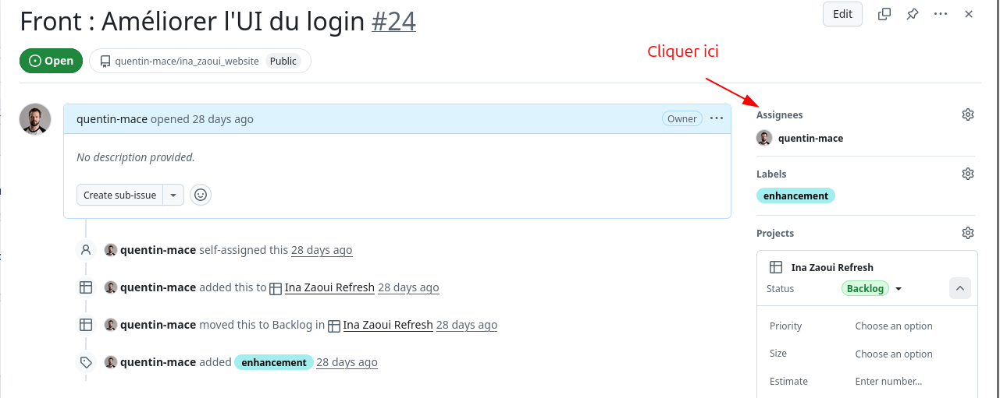
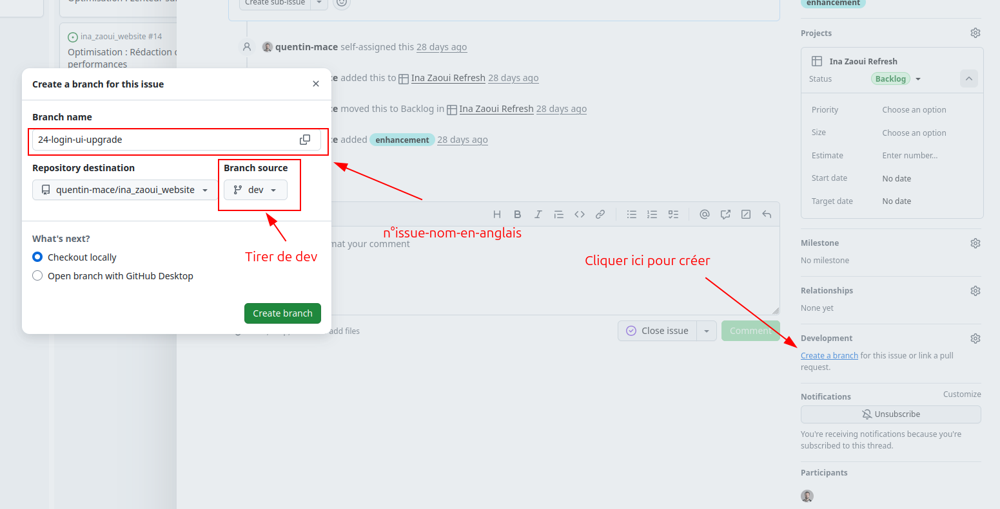

# Contribuer au projet

Merci de prendre le temps de contribuer. Ce guide décrit le workflow attendu (Issues, Pull Request, revue de code), les 
bonnes pratiques, ainsi que l’usage des tests et des outils de vérification.

## Pré-requis et installation

Le projet est une application **Symfony 7.4** (PHP ≥ 8.4) avec MySQL via Docker Compose.

- Installer les dépendances :

  ```bash
  composer install
  ```

- Configurer l’environnement local :

  ```bash
  cp .env.local.example .env.local
  ```

- Démarrer MySQL + Adminer :

  ```bash
  docker compose up -d
  ```

- Base de données (dev) :

  ```bash
  php bin/console doctrine:database:create --if-not-exists
  php bin/console doctrine:migrations:migrate -n
  php bin/console doctrine:fixtures:load -n
  ```

## Workflow GitHub (Issues → Branches → Pull Requests)

### 1) Ouvrir / traiter une Issue

- **Une issue = un sujet** : bug, amélioration, refactor, doc, perf.
- La description des issues devra contenir le **contexte**, **comportement actuel**, **comportement attendu**, et si 
possible une **procédure de reproduction**.
- Pour traiter une issue, il faudra d'abord vous l'assigner dans GitHub.

**S'assigner une issue :**



### 2) Créer une branche dédiée

- Avant de commencer à travailler sur une issue, il faudra créer une branche dédiée. Vous pouvez le faire directement 
depuis l'issue GitHub.

**Créer une branche depuis l'issue :**



- La convention de nommage est `23-branch-name`.
- Commence toujours par le numéro de l'issue.
- Les espaces sont toujours des tirets. (`-`)
- De nom de la branche doit être en anglais, et le plus court et explicite possible.

**Exemples :**

✅ **DO (Bon)** :

- `23-fix-guest-access-error`
- `42-add-media-upload`
- `15-refactor-n-plus-one-queries`
- `8-update-user-permissions`

❌ **DON'T (Mauvais)** :

- `fix-bug` (pas de numéro d'issue)
- `23 fix guest access` (espaces au lieu de tirets)
- `23-corriger-acces-invite` (français au lieu d'anglais)
- `23-fix-the-bug-where-guests-cannot-access-their-media-when-they-are-not-authorized` (trop long et verbeux)

### 3) Commits

- Vos commits doivent être les plus **petits** et **cohérents** possible (un objectif par commit dans l'idéal).
- Message de commit clair : verbe à l’infinitif + périmètre.
  - Exemple : `Fix accès invité sans média`
  - Exemple : `Refactor requête pour éviter N+1 sur la liste invités`

### 4) Pull Request

Avant d’ouvrir la PR :

- **Merge** la branche de référence dans votre branche si nécessaire (conflits par exemple).
- Utiliser la méthode Boy-Scout ! Laisser le code dans un état plus propre qu’à votre arrivée.
- Exécuter la checklist “Qualité” ci-dessous :
  - `vendor/bin/phpstan analyse` → zéro erreur
  - `vendor/bin/php-cs-fixer check` → zéro diff
  - `php bin/phpunit` → suite verte

Dans la PR :

- Expliquer **le pourquoi** (problème) et **le quoi** (approche).
- Indiquer l’impact : migrations, config, données, templates, sécurité.
- Donner un **plan de test** (étapes concrètes).
- Lier l’issue : `Closes #123` si applicable.
- Pour les changements visibles, joindre des **captures** (avant/après) ou une description UI précise.

### 5) Code review

Attentes côté auteur :

- Répondre aux commentaires, ajuster le code, et **mettre à jour** la description/plan de test si nécessaire.
- Préférer des changements itératifs : petits ajustements faciles à relire.

Attentes côté relecteur :

- Vérifier **fonctionnel**, **lisibilité**, **tests**, **perf** (N+1), **sécurité**, **DX** (maintenabilité).
- Prioriser les retours bloquants (bug/sécurité) vs suggestions (style/optional).

## Bonnes pratiques de code (Symfony / PHP)

- **Conventions Symfony** : services, injection de dépendances, configuration via `config/`.
- **Séparation des responsabilités** :
  - Contrôleurs : orchestration HTTP (mince).
  - Domaine / services : logique métier.
  - Repositories : accès aux données (Doctrine).
  - Templates : pas de logique métier lourde.
- **Doctrine / performance** :
  - Surveiller les requêtes et éviter les problèmes **N+1** (voir `docs/PerformanceReport.md`).
  - Préférer des requêtes explicites (joins, fetch) lorsque nécessaire.
- **Sécurité** :
  - Ne jamais exposer de secrets dans des fichiers versionnés.
  - S’appuyer sur les mécanismes Symfony (Security, validation, CSRF selon le contexte).

## Tests

Le dépôt est configuré pour PHPUnit (voir `phpunit.xml.dist`).

### Base de test

Le test utilise `APP_ENV=test` et une base dédiée via `.env.test`.

1) Créer la base (si besoin) :

```bash
php bin/console doctrine:database:create --env=test --if-not-exists
```

2) Appliquer les migrations :

```bash
php bin/console doctrine:migrations:migrate --env=test -n
```

3) Charger les fixtures :

```bash
php bin/console doctrine:fixtures:load --env=test -n
```

### Lancer la suite

```bash
php bin/phpunit
```

Bonnes pratiques :

- Ajouter/adapter des tests quand vous corrigez un bug ou ajoutez une fonctionnalité.
- Viser des tests **stables** (pas de dépendance à l’ordre d’exécution, pas d’aléatoire non contrôlé).

## Outils de vérification (qualité / analyse)

### Vérifications rapides (recommandées avant PR)

- Vérifier la config Composer :

```bash
composer validate
```

- Lints Symfony (si les commandes existent dans votre installation Symfony) :

```bash
php bin/console lint:container
php bin/console lint:twig templates
php bin/console lint:yaml config
php bin/console lint:translation translations
```

> Si une commande `lint:*` n’est pas disponible dans votre environnement, exécutez au minimum les tests et vérifiez la page concernée manuellement (profiler Symfony conseillé).

### Analyse statique (PHPStan)

Configuré via `phpstan.dist.neon` au niveau 6, avec l’extension Doctrine. Aucune erreur ne doit être introduite.

```bash
vendor/bin/phpstan analyse
```

### Formatage (PHP CS Fixer)

Configuré via `.php-cs-fixer.dist.php`. Le code soumis doit respecter le style du projet.

```bash
# Vérifier sans modifier
vendor/bin/php-cs-fixer check

# Corriger automatiquement
vendor/bin/php-cs-fixer fix
```

## Gestion des fichiers et secrets

- Ne pas versionner :
  - `/.env.local` et variantes locales (voir `.gitignore`),
  - `/var/`, `/vendor/`,
  - le contenu de `public/uploads` (médias locaux).
- Ne jamais committer de secrets, tokens, identifiants, dumps BDD.

## Conseils de maintenance

- Garder les changements **petits** et **bien encapsulés**.
- Mettre à jour la doc si vous changez une commande, un prérequis, ou un flux (README, `docs/`).
- Sur les écrans qui listent des entités (ex. invités, médias), vérifier systématiquement :
  - nombre de requêtes Doctrine (profiler),
  - temps de rendu,
  - pagination/chargement si la volumétrie augmente.

